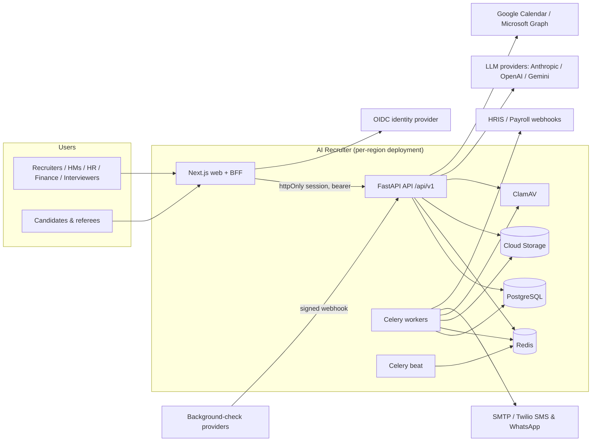
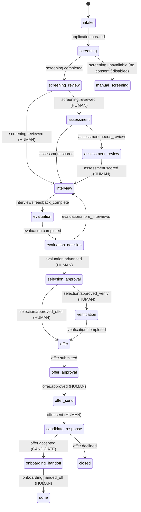

# Software Design Document — AI Recruiter

## 1. System context



## 2. Architectural style

**Modular monolith with hexagonal boundaries.** The monolith keeps one deployable and one database for transactional
integrity across the hiring workflow. Modules are strict: the API layer only talks to services, services own business
rules, and adapters sit behind ports.

```
backend/app
├── api/            Driving adapters: FastAPI routers, deps (auth, RBAC, pagination, idempotency), middleware
├── services/       Application services: one module per bounded context (requisitions, candidates, screening, …)
├── domain/         Pure domain: enums, permission catalogue, pipeline state machine and human gates
├── ai/             Agents, orchestrator, guardrails, CV parser, taxonomy, embeddings, prompts, providers
├── integrations/   Driven adapters: calendars, messaging, HRIS/webhooks
├── storage/        Object storage port (local, Google Cloud Storage)
├── models/         SQLAlchemy ORM (persistence adapter)
├── workers/        Celery app, tasks, dispatcher
└── core/           Config, security, logging, errors, rate limiting, idempotency
```

Dependencies point inward. `domain` imports nothing from the other layers. `ai/agents` depend on the `LLMProvider`
port, never on a vendor SDK. Swapping Anthropic ↔ OpenAI ↔ Gemini ↔ local is one environment variable
(`LLM_PROVIDER`).

## 3. Core flow and the orchestrator



The orchestrator (`app/ai/orchestrator.py`) is a durable, event-driven state graph. It is semantically equivalent to a
LangGraph `StateGraph` with a Postgres checkpointer and `interrupt` nodes:

- **Nodes** are `auto` (run agents), `human` (interrupt until someone with a named permission acts), `external` (wait
  for the candidate) or `terminal`.
- **Checkpoints**: each transition is persisted to `workflow_runs.state/history` in the same transaction as the
  business change.
- **Resumption**: API actions emit events (`screening.reviewed`, `offer.approved`, …) that resume the graph.
- **Failure handling**: an agent failure moves the run to `waiting_human` with an error, so a recruiter can act
  manually. A pipeline never gets stuck.

*Why not a library runtime:* hiring workflows last weeks, are resumed by HTTP events from many users, and must be
auditable row by row in the tenant's own database. An explicit transition table gives the same semantics with no extra
infrastructure, and it is unit-tested (`tests/unit/test_orchestrator_graph.py`). If multi-step LLM tool-use loops are
added later, LangGraph can run *inside* an auto node without changing this design.

**The pipeline state machine is the enforcement point.** `app/domain/pipeline.py` defines allowed transitions and
`HUMAN_GATES`. `services.applications.move_stage` is the single choke point for every stage change and raises
`ApprovalRequired` if an agent or system actor attempts a gated transition.

## 4. Data architecture

- PostgreSQL 16, 46 normalised tables. See `erd.md` (generated) and migrations in `backend/alembic/versions`.
- **Multi-tenancy:** shared schema; every tenant-owned row carries `organization_id`. `services.common.get_scoped`
  makes cross-tenant rows indistinguishable from missing ones (404). Tested in `test_tenant_isolation`.
- **Integrity:** check constraints (salary and budget ranges, ratings 1-5, positive headcount); unique constraints
  (one application per candidate per job, one scorecard per interviewer per interview, offer versions); enum columns as
  VARCHAR + CHECK for painless migrations.
- **Indexes:** tenant + status/stage composites, time-series (`applied_at`, `created_at`), GIN on tags, a trigram
  index for fuzzy candidate search, entity indexes for audit and AI logs.
- **Encryption:** storage-level (Cloud KMS keys on Cloud SQL, Cloud Storage and Memorystore) plus application-level Fernet encryption for high-risk PII:
  phone numbers, raw CV text, interview transcripts, integration credentials.
- **Audit:** `audit_logs` is append-only, enforced by a trigger that rejects UPDATE and DELETE.
- **Embeddings:** stored as `real[]`. Matching uses explainable requirement coverage (75%) plus cosine similarity
  (25%). The `Embedder` port supports hosted embeddings. Move to pgvector/HNSW when a tenant exceeds ~200k candidates.

## 5. API design

- REST, URI-versioned (`/api/v1`), OpenAPI 3.1 (`docs/api/openapi.json`, 158 operations), RFC 7807 errors with stable
  `code` and `request_id`.
- Pagination `page/page_size≤200`, whitelisted `sort` fields (anything else → 422), filter query parameters.
- `Idempotency-Key` on critical POSTs (applications, approvals, selection, offer send, onboarding handoff).
- Rate limits: per user (authenticated) and per IP (auth/public), with Redis fixed windows and an in-process fallback.

## 6. Frontend

Next.js 16 (App Router, TypeScript, Tailwind 4). The browser never holds tokens: `/api/session` sets httpOnly,
SameSite=Lax cookies, and `/api/backend/*` is a backend-for-frontend proxy that attaches the bearer token and refreshes
transparently. `proxy.ts` protects staff routes. Permissions from `/auth/me` drive navigation and action visibility;
the API remains the enforcement point.

## 7. Asynchronous processing

Celery on Redis (acks-late, prefetch 1, separate `ai` queue). Outbound messages are persisted as `queued` and handed to
workers **after commit** by a SQLAlchemy `after_commit` hook, so nothing is sent for rolled-back work. Beat schedules
interview reminders (every 15 min), offer and assessment expiry (hourly), queued-message sweeps (every minute) and
retention purges (nightly). `TASK_ALWAYS_EAGER` runs jobs inline for tests. If the broker is down, jobs degrade to
inline execution.

## 8. Technology choices

| Concern | Choice | Rationale |
|---|---|---|
| API | FastAPI + Pydantic v2 | Typed contracts, generated OpenAPI, performance |
| ORM/migrations | SQLAlchemy 2 + Alembic | Mature, typed; migrations verified for round-trip and drift in CI |
| DB | PostgreSQL 16 | Transactions across the workflow, JSONB, GIN/trigram, Cloud SQL PITR |
| Jobs | Celery + Redis | Scheduling, retries, routing; Redis also serves rate limiting |
| AI | Provider port + official SDKs (anthropic, openai, google-genai) | Vendor neutrality, structured outputs, graceful fallback |
| Auth | JWT (15 min) + rotating refresh tokens + OIDC | Stateless API; reuse detection; enterprise SSO |
| Frontend | Next.js + Tailwind | SSR/BFF, security headers, fast iteration |
| Infra | GKE, Cloud SQL, Memorystore, Cloud Storage, Cloud KMS, Cloud Armor via Terraform; Helm | Managed, encrypted, multi-zone; declarative and reviewable |
