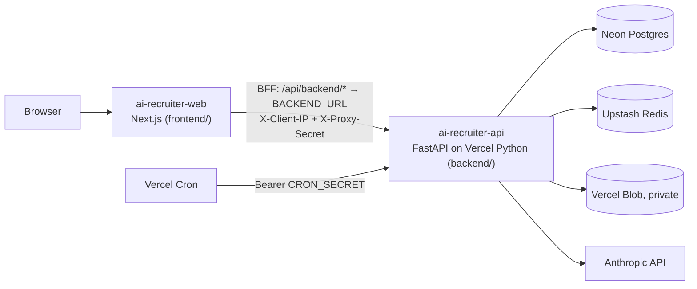

# Deploying on Vercel

The default production target is Vercel: two Vercel projects built from this monorepo, with managed
data services from the Vercel Marketplace. The Kubernetes/Google Cloud path
([deployment.md](deployment.md)) remains available for workloads that need long-running workers or an in-cluster
malware scanner.



| Concern | On Vercel |
|---|---|
| Web app | `frontend/` as a Next.js project |
| API | `backend/` as a FastAPI project (Python 3.12, `app/main.py`, dependencies from `uv.lock`), functions up to 300 s |
| PostgreSQL | Neon (Marketplace) – `DATABASE_URL` (pooled) for the app, the direct URL for migrations |
| Redis (rate limits, idempotency) | Upstash Redis (Marketplace) over TLS |
| Candidate documents | Vercel Blob store with **private** access; every read is authenticated |
| Background jobs | Run inline in the request (`TASK_ALWAYS_EAGER=true`); periodic jobs via Vercel Cron |
| Migrations | GitHub Actions runs `alembic upgrade head` before each API deployment |
| Releases | GitHub Actions: build → deploy without traffic → smoke test → `vercel promote` |

## Differences from the Kubernetes deployment

- **No Celery workers.** Jobs that were queued (CV parsing, AI agents, notifications) run inside the request
  that triggers them, so those requests are slower. The four periodic jobs run from Vercel Cron:

  | Job | Schedule | Endpoint |
  |---|---|---|
  | Deliver queued messages (retries) | every 5 min | `/api/v1/internal/cron/deliver-communications` |
  | Interview reminders | every 15 min | `/api/v1/internal/cron/interview-reminders` |
  | Expire offers / assessments | hourly | `/api/v1/internal/cron/expire-stale-items` |
  | Retention purge | daily 02:30 UTC | `/api/v1/internal/cron/retention-purge` |

  These schedules need a **Pro** (or Enterprise) plan; Hobby only allows daily cron jobs and rejects the
  deployment otherwise. On Hobby, change every schedule in `backend/vercel.json` to run once a day.
- **No ClamAV.** Uploads still get the built-in signature check. For real malware scanning, point `CLAMAV_HOST` /
  `CLAMAV_PORT` at a clamd you host elsewhere (TCP), and set `REQUIRE_MALWARE_SCAN=true`.
- **Upload size.** Vercel caps request bodies at 4.5 MB, so set `MAX_UPLOAD_MB=4`.
- **Rate limiting** keys on the real client IP: Vercel overwrites `X-Forwarded-For` between the web and API
  projects, so the web BFF passes the client IP in `X-Client-IP` with the shared `PROXY_SHARED_SECRET`, and the
  API only trusts it when the secret matches.

## One-time setup

1. **Create two Vercel projects** from this GitHub repository (Add New → Project → import):
   - `ai-recruiter-api`: Root Directory `backend`, framework preset **FastAPI**.
   - `ai-recruiter-web`: Root Directory `frontend`, framework preset **Next.js**.

   Git deployments are disabled in both `vercel.json` files; releases go through GitHub Actions so migrations run
   first.
2. **Add storage to `ai-recruiter-api`** (project → Storage):
   - **Neon** Postgres: injects `DATABASE_URL` (pooled) and `DATABASE_URL_UNPOOLED`.
   - **Upstash** Redis: injects `REDIS_URL` (if your integration only provides `KV_URL`, set `REDIS_URL` to that
     value).
   - **Blob** store with **Private** access: injects `BLOB_READ_WRITE_TOKEN`.
3. **Environment variables** (Production):

   `ai-recruiter-api`

   | Variable | Value |
   |---|---|
   | `ENVIRONMENT` | `production` |
   | `JWT_SECRET` | `python -c "import secrets;print(secrets.token_urlsafe(48))"` |
   | `DATA_ENCRYPTION_KEY` | `python -c "from cryptography.fernet import Fernet;print(Fernet.generate_key().decode())"` (keep it stable) |
   | `CRON_SECRET` | random string, 16+ characters (Vercel Cron sends it as a bearer token) |
   | `PROXY_SHARED_SECRET` | random string, same value as on the web project |
   | `STORAGE_BACKEND` | `vercel_blob` |
   | `TASK_ALWAYS_EAGER` | `true` |
   | `MAX_UPLOAD_MB` | `4` |
   | `DATABASE_POOL_SIZE` / `DATABASE_MAX_OVERFLOW` | `2` / `3` (Neon's pooler does the rest) |
   | `LLM_PROVIDER` / `LLM_MODEL` / `ANTHROPIC_API_KEY` | `anthropic` / `claude-opus-5-5` / your key (or `local` for no external AI) |
   | `PUBLIC_BASE_URL`, `CORS_ORIGINS` | the web app URL, e.g. `https://ai-recruiter-web.vercel.app` |
   | `OIDC_REDIRECT_URI` (optional SSO) | `<web URL>/api/session/oidc`, plus `OIDC_ISSUER`, `OIDC_CLIENT_ID`, `OIDC_CLIENT_SECRET` |
   | `EMAIL_BACKEND` + `SMTP_HOST`, `SMTP_PORT`, `SMTP_USERNAME`, `SMTP_PASSWORD`, `SMTP_USE_TLS`, `EMAIL_FROM` | your mail provider |
   | `REQUIRE_MALWARE_SCAN` | `false` unless you configure `CLAMAV_HOST` |

   `ai-recruiter-web`

   | Variable | Value |
   |---|---|
   | `BACKEND_URL` | the API production URL, e.g. `https://ai-recruiter-api.vercel.app` |
   | `PROXY_SHARED_SECRET` | same value as on the API |

4. **GitHub** → Settings → Environments → create `vercel`, then add:

   | Name | Kind | Value |
   |---|---|---|
   | `VERCEL_TOKEN` | secret | a Vercel access token scoped to the team |
   | `MIGRATION_DATABASE_URL` | secret | Neon's **direct** (unpooled) connection string |
   | `VERCEL_AUTOMATION_BYPASS_SECRET` | secret (optional) | only if Deployment Protection covers production deployment URLs |
   | `VERCEL_ORG_ID` | variable | team ID (Team Settings → General) |
   | `VERCEL_API_PROJECT_ID` / `VERCEL_WEB_PROJECT_ID` | variable | each project's ID (Project Settings → General) |
   | `VERCEL_API_URL` / `PUBLIC_URL` | variable | the API and web production URLs |

   Add required reviewers to the `vercel` environment if releases should wait for approval.
5. **Deploy**: push to `main`, or run **Deploy (Vercel)** from the Actions tab. Then create the first tenant:
   ```bash
   cd backend && DATABASE_URL="<direct URL>" DATA_ENCRYPTION_KEY="<same key as the API>" \
     python -m scripts.seed --slug demo --password '<strong password>'
   ```
   The seed encrypts candidate PII, so it must use the API's `DATA_ENCRYPTION_KEY`.

## Releases and rollback

`.github/workflows/vercel.yml` on every push to `main`:

1. `alembic upgrade head` against Neon (direct connection). Migrations are expand/contract, so the version still
   serving keeps working.
2. `vercel build` + `vercel deploy --prebuilt --prod --skip-domain` for the API: a production build that takes no
   traffic yet.
3. Smoke test `GET /readyz` (database + Redis) on that deployment, then `vercel promote`. If the smoke test fails,
   the previous deployment keeps serving.
4. The same for the web app (`GET /login`).

Roll back instantly in the Vercel dashboard (Deployments → previous → Promote / Instant Rollback) or with
`vercel rollback <deployment-url>`. Neon branching/point-in-time restore covers data recovery.

## Local development

Unchanged: `docker compose up` runs PostgreSQL, Redis, the Cloud Storage emulator and Celery locally.
